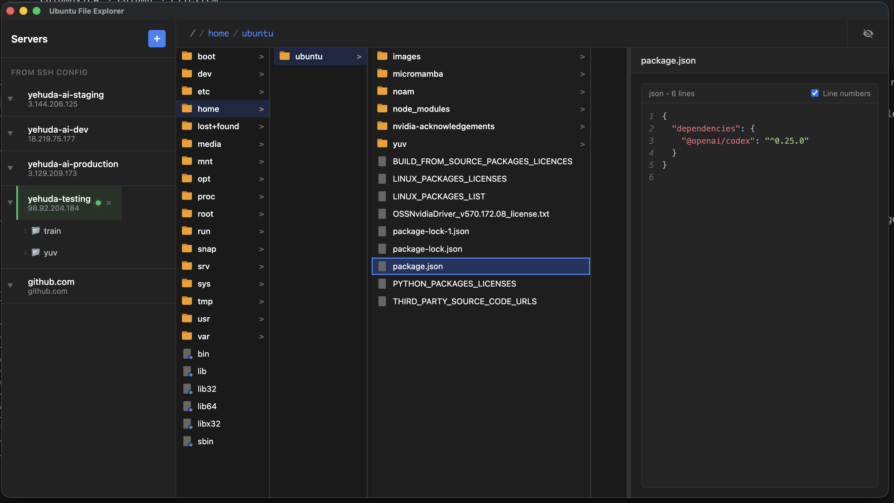

# Ubuntu File Explorer

A macOS Finder-like file explorer for browsing remote Ubuntu/Linux servers via SSH/SFTP.



## Features

- **Miller Column Navigation** — Browse remote servers with a familiar Finder-style interface
- **SSH/SFTP Connection** — Connect using your existing `~/.ssh/config` or add custom connections
- **Key & Password Auth** — Support for SSH key authentication and encrypted password storage
- **Instant Previews** — Preview images, code, markdown, and PDF files without downloading
- **Syntax Highlighting** — Code preview with syntax highlighting for 100+ languages
- **Lightbox Viewer** — Full-screen viewing for images, markdown, and PDFs with keyboard navigation
- **File Operations** — Download, upload, rename, delete, and move files
- **Folder Transfer** — Upload and download entire folders with progress tracking
- **Per-Server Favorites** — Bookmark frequently accessed folders for each server
- **List View** — Toggle between Miller columns and sortable list view with `Cmd+1` / `Cmd+2`
- **Hidden Files Toggle** — Show/hide dotfiles with `Cmd+Shift+.`
- **Large File Support** — Stream and virtualize files with 10,000+ lines
- **In-App Help** — Built-in help system with keyboard shortcuts and usage guide (`Cmd+/`)

## Requirements

- **macOS** 12.0 (Monterey) or later
- **Windows** 10 or later
- **Linux** Ubuntu 20.04+ / Debian 11+ / Fedora 36+
- Node.js 18+ (for building from source)
- SSH access to remote servers

## Installation

### Download

Download the latest release for your platform from [Releases](https://github.com/yorilavi/ubuntu-file-explorer/releases).

### Build from Source

```bash
git clone https://github.com/yorilavi/ubuntu-file-explorer.git
cd ubuntu-file-explorer
npm install
```

#### Development

```bash
npm start
```

#### Production Build

```bash
npm run make
```

This produces platform-specific packages in `out/make/`:

| Platform | Output | Install |
|----------|--------|---------|
| **macOS** | `out/make/zip/darwin/arm64/*.zip` | Unzip, drag `.app` to `/Applications` |
| **Windows** | `out/make/squirrel.windows/` | Run the `.exe` installer |
| **Ubuntu/Debian** | `out/make/deb/x64/*.deb` | `sudo dpkg -i *.deb` |
| **Fedora/RHEL** | `out/make/rpm/x64/*.rpm` | `sudo rpm -i *.rpm` |

To update an existing install, quit the app and repeat the install step with the new build.

## SSH Configuration

Ubuntu File Explorer reads your `~/.ssh/config` file to list available servers. Example config:

```
Host myserver
    HostName 192.168.1.100
    User ubuntu
    IdentityFile ~/.ssh/id_rsa

Host production
    HostName prod.example.com
    User deploy
    Port 2222
```

You can also add custom connections directly in the app using the **+** button in the sidebar.

## Keyboard Shortcuts

| Shortcut | Action |
|----------|--------|
| `Up` `Down` | Navigate files |
| `Left` `Right` | Navigate columns |
| `Enter` | Open folder / Select file |
| `Space` | Open/close lightbox (full-screen preview) |
| `Escape` | Close lightbox / Cancel active operation |
| `Cmd+1` | Miller column view |
| `Cmd+2` | List view |
| `Cmd+Shift+.` | Toggle hidden files (dotfiles) |
| `Cmd+L` | Edit path bar directly |
| `Cmd+/` | Open help dialog |
| `Delete` | Delete selected file or folder |

### In Lightbox

| Shortcut | Action |
|----------|--------|
| `Up` `Down` | Previous/next file |
| `Left` `Right` | Previous/next page (PDF) |
| `Escape` or `Space` | Close lightbox |

## Project Structure

```
src/
├── main/           # Electron main process (SSH/SFTP, file ops, IPC)
│   ├── ssh/        # SSH/SFTP connection service
│   ├── ipc/        # IPC handler modules
│   ├── cache/      # Preview cache management
│   └── main.ts     # Entry point
├── preload/        # Preload scripts (context bridge)
├── renderer/       # React application (UI)
│   ├── components/ # React components
│   ├── hooks/      # Custom React hooks
│   └── App.tsx     # Root component
└── shared/         # Shared TypeScript types
```

## Tech Stack

- [Electron](https://www.electronjs.org/) — Cross-platform desktop framework
- [React 19](https://react.dev/) — UI framework
- [TypeScript](https://www.typescriptlang.org/) — Type-safe JavaScript
- [Vite](https://vitejs.dev/) — Fast build tool with HMR
- [ssh2](https://github.com/mscdex/ssh2) — SSH/SFTP client
- [react-pdf](https://github.com/wojtekmaj/react-pdf) — PDF rendering
- [react-syntax-highlighter](https://github.com/react-syntax-highlighter/react-syntax-highlighter) — Syntax highlighting

## Security

- Credentials encrypted via OS keychain (Electron safeStorage)
- Sandboxed renderer process
- Context isolation enabled
- No node integration in renderer

See [SECURITY.md](SECURITY.md) for vulnerability reporting.

## Contributing

Contributions are welcome! Please read [CONTRIBUTING.md](CONTRIBUTING.md) for guidelines.

This project follows the [Contributor Covenant Code of Conduct](CODE_OF_CONDUCT.md).

## License

[MIT](LICENSE)

## Changelog

See [CHANGELOG.md](CHANGELOG.md) for version history.
