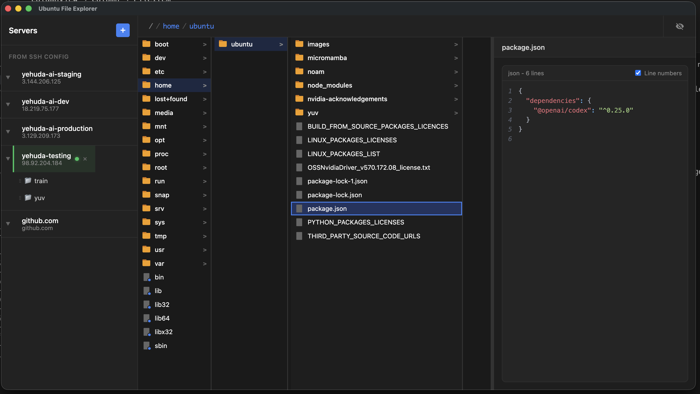

# Ubuntu File Explorer

A macOS Finder-style file explorer for browsing remote Ubuntu/Linux servers over SSH/SFTP. Connect to any server from your `~/.ssh/config`, navigate with Miller columns, and preview images, code, markdown, and PDFs without downloading them first.



## Table of Contents

- [Features](#features)
- [Quick Start](#quick-start)
- [Installation](#installation)
- [Connecting to Servers](#connecting-to-servers)
- [Using the App](#using-the-app)
- [Keyboard Shortcuts](#keyboard-shortcuts)
- [Where Data Is Stored](#where-data-is-stored)
- [Troubleshooting](#troubleshooting)
- [Development](#development)
- [Security](#security)
- [Contributing](#contributing)
- [License](#license)

## Features

- **Miller column navigation** — Finder-style columns with full keyboard control and virtual scrolling for directories with thousands of entries
- **List view** — Sortable list with name, size, kind, and modified date; switch views with `Cmd+1` / `Cmd+2`
- **Reads your SSH config** — Servers from `~/.ssh/config` appear automatically, including `Include`, wildcard, and `Match` handling
- **Three auth methods** — SSH agent, private key (with optional passphrase), or password
- **Connection settings** — Gear button on each server row to review a config entry or edit a custom connection
- **Instant previews** — Images (with EXIF data), code with syntax highlighting, GitHub-flavored markdown, and PDFs
- **Lightbox** — Full-screen viewer for images, markdown, and PDFs with arrow-key navigation between files
- **Large file streaming** — Files with 10,000+ lines load in chunks and render through a virtualized viewer, so the UI never freezes
- **File operations** — Download, upload, rename, delete, and move (with a 5-second undo window)
- **Folder transfers** — Upload and download entire folders with progress, cancel, retry, and Finder-style conflict renaming
- **Per-server favorites** — Bookmark folders on each server and drag to reorder
- **Hidden files toggle** — Show or hide dotfiles with `Cmd+Shift+.`; the choice persists
- **Persistent layout** — Column widths, preview panel width, window size, and position are remembered
- **In-app help** — Shortcuts and usage guide available any time with `Cmd+/`

## Quick Start

1. Install the app (see [Installation](#installation)) or run `npm start` from a clone.
2. Make sure at least one host is defined in `~/.ssh/config`, or click **+** in the sidebar to add one.
3. Click a server in the sidebar. The app connects and shows the home directory.
4. Click through folders. Select a file to preview it in the right panel; press `Space` for full-screen.
5. Right-click a file or folder for download, upload, rename, delete, move, and favorites.

## Installation

### Requirements

- SSH access to at least one Linux server
- **macOS** 12 (Monterey) or later is the primary supported platform
- Windows 10+ and Ubuntu 20.04+ / Debian 11+ / Fedora 36+ builds are produced by the build pipeline but are less tested
- Node.js 18+ and npm 9+ if building from source

### Download a Release

Grab the latest build for your platform from the [Releases](https://github.com/yorilavi/ubuntu-file-explorer/releases) page.

| Platform | File | Install |
|----------|------|---------|
| macOS | `.zip` | Unzip, drag `Ubuntu File Explorer.app` into `/Applications` |
| Windows | `.exe` | Run the installer |
| Ubuntu / Debian | `.deb` | `sudo dpkg -i ubuntu-file-explorer_*.deb` |
| Fedora / RHEL | `.rpm` | `sudo rpm -i ubuntu-file-explorer-*.rpm` |

Releases are not code-signed. On macOS, the first launch may be blocked by Gatekeeper; right-click the app, choose **Open**, and confirm.

### Build from Source

```bash
git clone https://github.com/yorilavi/ubuntu-file-explorer.git
cd ubuntu-file-explorer
npm install
npm start          # development mode with hot reload
```

To produce installable packages:

```bash
npm run make
```

Output lands in `out/make/`:

| Platform | Path |
|----------|------|
| macOS | `out/make/zip/darwin/<arch>/*.zip` |
| Windows | `out/make/squirrel.windows/<arch>/*.exe` |
| Debian / Ubuntu | `out/make/deb/<arch>/*.deb` |
| Fedora / RHEL | `out/make/rpm/<arch>/*.rpm` |

Each platform must be built on that platform (macOS packages on macOS, and so on).

On macOS, `npm run package` and `npm run make` also copy the fresh build into `/Applications`, re-sign it ad hoc, and re-register it with Launch Services, so Spotlight always opens the build you just made. On Windows and Linux, quit the app and repeat the install step with the new build.

## Connecting to Servers

### From `~/.ssh/config`

On launch the app parses your SSH config and lists every `Host` entry except the `*` wildcard. `Include` directives, wildcard patterns, and `Match` blocks are resolved the same way OpenSSH resolves them.

```
Host myserver
    HostName 192.168.1.100
    User ubuntu
    IdentityFile ~/.ssh/id_ed25519

Host production
    HostName prod.example.com
    User deploy
    Port 2222
```

How each entry is mapped:

| SSH config field | Used for | Default |
|------------------|----------|---------|
| `Host` | Display name and internal ID | required |
| `HostName` | Address to connect to | the `Host` alias |
| `User` | SSH username | empty (connection will fail) |
| `Port` | SSH port | `22` |
| `IdentityFile` | Private key path; switches auth to **key** | none (uses **agent** auth) |

Entries without `IdentityFile` authenticate through your SSH agent using the `SSH_AUTH_SOCK` environment variable. `ProxyJump` and `ProxyCommand` are not supported.

### Custom connections

Click **+** in the sidebar to add a server that is not in your SSH config. You can choose **SSH Key**, **SSH Agent**, or **Password** authentication. Custom connections are saved locally. Click the gear button on a server row to review its settings; for custom connections you can edit the host, port, username, display name, auth method, key path, and saved password there. Entries from `~/.ssh/config` open read-only.

### Authentication

| Method | How it works |
|--------|--------------|
| **Agent** | Uses the running SSH agent. Add your key with `ssh-add` first. Default for config entries without an `IdentityFile`. |
| **Key** | Reads the private key file from disk. If the key is passphrase-protected, you are prompted for the passphrase. |
| **Password** | Entered when you add or edit the connection. Tick **Save password securely** to keep it encrypted in the OS keychain; otherwise it is asked for on each connect. |

## Using the App

### Navigating

- **Columns** — Clicking a folder opens it in a new column to the right. Use the arrow keys to move within and between columns. Older columns scroll away on the left as you go deeper.
- **Path bar** — Click any segment to jump to that directory, or press `Cmd+L` to type a path directly.
- **Typeahead** — Start typing a filename while browsing to jump to the first match.
- **Favorites** — Right-click a folder and choose **Add to Favorites**. Favorites are per server and appear under the server in the sidebar. Drag to reorder.
- **Resizing** — Drag column dividers or the preview panel edge. Double-click a divider to reset its width.

### Previewing

Select a file to preview it in the right panel. Press `Space` to open the lightbox for full-screen viewing and use `Up` / `Down` to move to the previous or next file.

| Type | Details |
|------|---------|
| Images | JPG, PNG, GIF, WebP, and more; EXIF metadata shown for photos; zoom and pan in the lightbox |
| Code and text | Syntax highlighting for 100+ languages; files over ~500 lines stream in chunks through a virtualized viewer |
| Markdown | Rendered as GitHub Flavored Markdown with highlighted code blocks |
| PDF | Page navigation, page indicator, fit-width / fit-page / 50–200% zoom; a warning appears for documents over 100 pages |

Files larger than 50 MB are not previewed. Previewed files are cached locally (see [Where Data Is Stored](#where-data-is-stored)) and refetched only when the remote file's size or modification time changes.

### File operations

Right-click any file or folder for the context menu:

- **Download** — Saves to a location you choose. Folders download recursively with a progress toast.
- **Upload** — Uploads a local file or folder into the selected directory. When hidden files are off, `.DS_Store` files are skipped automatically.
- **Rename** — Renames in place.
- **Move** — Opens a remote folder picker. After the move, a 5-second **Undo** appears in the toast.
- **Delete** — Also available with the `Delete` key.

Every transfer shows a progress toast with a **Cancel** button. Press `Escape` to cancel the active operation. Failed folder transfers offer **Retry**. Downloads that would overwrite an existing local file get a numbered suffix, matching Finder behavior.

## Keyboard Shortcuts

### Navigation

| Shortcut | Action |
|----------|--------|
| `Up` / `Down` | Move selection within a column |
| `Left` / `Right` | Move between columns |
| `Enter` | Open folder / select file |
| `Cmd`+click / `Shift`+click | Add to selection / select a range |
| `Cmd+L` | Edit the path bar |
| `Cmd+1` | Column view |
| `Cmd+2` | List view |
| `Cmd+Shift+.` | Toggle hidden files |
| `Cmd+/` | Open help |

### Preview and lightbox

| Shortcut | Action |
|----------|--------|
| `Space` | Open or close the lightbox |
| `Up` / `Down` | Previous / next file in the lightbox |
| `Left` / `Right` | Previous / next page (PDF) |
| `Escape` | Close the lightbox |

### File operations

| Shortcut | Action |
|----------|--------|
| `Delete` | Delete the selected file or folder |
| `Escape` | Cancel the active transfer |

On Windows and Linux, `Ctrl` works for `Cmd+L` and for multi-select clicks. The other `Cmd` shortcuts currently require the Meta/Windows key.

## Where Data Is Stored

All app data lives in the Electron user-data directory:

| Platform | Directory |
|----------|-----------|
| macOS | `~/Library/Application Support/ubuntu-file-explorer/` |
| Windows | `%APPDATA%\ubuntu-file-explorer\` |
| Linux | `~/.config/ubuntu-file-explorer/` |

Inside it:

| File or folder | Contents |
|----------------|----------|
| `config.json` | Custom connections added with the **+** button |
| `credentials.json` | Remembered passwords, encrypted with the OS keychain via Electron `safeStorage` |
| `favorites.json` | Per-server favorite folders |
| `ui-preferences.json` | Hidden files toggle, view mode, column and panel widths, window bounds |
| `preview-cache/` | Downloaded preview copies, capped at 500 MB with oldest-first eviction |

Deleting `preview-cache/` is always safe. The app never modifies your `~/.ssh/config`.

## Troubleshooting

**A server from my SSH config is missing.**
Only `Host` entries with a literal alias are listed. Patterns containing `*`, `?`, or `!` and entries reached only through `Match` are skipped. A line with several aliases, such as `Host web web-prod`, produces one entry per alias. Check that the file is at `~/.ssh/config` and readable.

**Connection fails with "All configured authentication methods failed".**
For agent auth, run `ssh-add -l` in a terminal to confirm the key is loaded, then relaunch the app so it picks up `SSH_AUTH_SOCK`. If you launched the app from Finder and the agent is not visible, start it from a terminal with `open -a "Ubuntu File Explorer"`. For key auth, confirm the `IdentityFile` path exists and the key matches the server's `authorized_keys`.

**"Failed to read key file".**
The `IdentityFile` path could not be opened. Paths with `~` are expanded; relative paths are not. Use an absolute path or `~/.ssh/...`.

**Password is not saved even though I ticked "Save password securely".**
Encrypted storage requires the OS keychain to be available. On Linux this needs a running secret service such as `gnome-keyring` or `kwallet`.

**A server shows a connection error.**
Double-click it in the sidebar to retry.

**Previews are stale or a file will not open.**
Quit the app and delete the `preview-cache/` folder listed above. Files over 50 MB are intentionally not previewed.

**Something else went wrong.**
Open **View → Toggle Developer Tools** and check the Console tab. Main-process logs are prefixed with the service name, for example `[ssh-service]`. Include those lines in a [bug report](https://github.com/yorilavi/ubuntu-file-explorer/issues/new?template=bug_report.md).

## Development

### Scripts

| Command | Purpose |
|---------|---------|
| `npm start` | Launch in development mode with Vite hot reload |
| `npm run lint` | Run ESLint over all TypeScript |
| `npm test` | Run the Vitest unit tests once |
| `npm run test:watch` | Run Vitest in watch mode |
| `npm run package` | Build an unpackaged app bundle into `out/` |
| `npm run make` | Build platform installers into `out/make/` |

Unit tests cover the SSH config parser and run in plain Node with Vitest. Everything else is tested manually; see [CONTRIBUTING.md](CONTRIBUTING.md) for the checklist.

Linting uses ESLint 9 with a flat config in `eslint.config.mjs`. The `overrides` block in package.json pins `yauzl` to 3.x because the 2.x version pulled in by Electron Forge's packager silently aborts zip extraction on Node 24 and newer, which made `npm run package` exit without producing anything.

### Project structure

```
src/
├── main/                      # Electron main process
│   ├── main.ts                # Entry point, window creation, IPC registration
│   ├── ssh/                   # SSH connection, SFTP, file ops, folder transfers, config parser
│   ├── ipc/                   # IPC handlers grouped by domain (ssh, preview, files, favorites, prefs)
│   ├── storage/               # electron-conf stores: connections, credentials, favorites, UI prefs
│   └── cache/                 # Preview cache with LRU eviction
├── preload/                   # Context bridge exposing a typed API to the renderer
├── renderer/                  # React UI
│   ├── App.tsx                # Root component and layout
│   ├── components/            # ColumnView, ListView, PreviewPanel, PathBar, sidebar, modals
│   ├── hooks/                 # Column/list navigation, preview loading, favorites, context menu
│   ├── utils/                 # File kind labels and formatters
│   └── types/                 # View-model types
└── shared/                    # Types shared between main and renderer
```

### Architecture notes

- The renderer runs sandboxed with context isolation and no Node integration. All SSH, filesystem, and storage work happens in the main process and is exposed through the preload bridge.
- One `ssh2` client is kept per server. SFTP sessions are opened on that client for directory listings, previews, and transfers.
- Previews are fetched to the local cache first and served from there. Code files over the streaming threshold are read in 100 KB chunks.
- Electron Fuses disable `RunAsNode`, `NODE_OPTIONS`, and CLI inspect flags in packaged builds, and enforce ASAR integrity.

### Tech stack

- [Electron 40](https://www.electronjs.org/) with [Electron Forge](https://www.electronforge.io/) and the Vite plugin
- [React 19](https://react.dev/) and [TypeScript 5](https://www.typescriptlang.org/)
- [Vitest](https://vitest.dev/) for unit tests, [ESLint 9](https://eslint.org/) for linting
- [ssh2](https://github.com/mscdex/ssh2) for SSH/SFTP, [ssh-config](https://github.com/cyjake/ssh-config) for config parsing
- [electron-conf](https://github.com/alex8088/electron-conf) for persistence
- [react-pdf](https://github.com/wojtekmaj/react-pdf), [react-markdown](https://github.com/remarkjs/react-markdown), [react-syntax-highlighter](https://github.com/react-syntax-highlighter/react-syntax-highlighter), [yet-another-react-lightbox](https://yet-another-react-lightbox.com/)
- [@tanstack/react-virtual](https://tanstack.com/virtual), [react-resizable-panels](https://github.com/bvaughn/react-resizable-panels), [dnd-kit](https://dndkit.com/), [sonner](https://sonner.emilkowal.ski/)

## Security

- Passwords are encrypted with Electron `safeStorage`, which uses the OS keychain. They are never written in plain text.
- Private keys are read from disk only at connect time and are not copied or stored.
- The renderer is sandboxed with context isolation and no Node integration.
- Server host keys are not currently verified against `~/.ssh/known_hosts`. Avoid connecting over untrusted networks to hosts you have not connected to before with `ssh`.

See [SECURITY.md](SECURITY.md) for how to report a vulnerability.

## Contributing

Pull requests are welcome. Read [CONTRIBUTING.md](CONTRIBUTING.md) for setup, branch naming, and the manual test checklist. This project follows the [Contributor Covenant Code of Conduct](CODE_OF_CONDUCT.md).

## License

[MIT](LICENSE) © yorilavi

Version history lives in [CHANGELOG.md](CHANGELOG.md).
